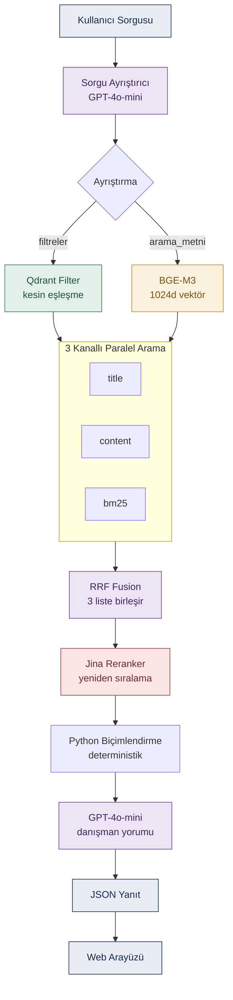

# Pusula: YKS Tercih Asistanı

Öğrencilerin doğal dille soru sorarak kendilerine uygun üniversite programlarını bulmalarını sağlayan, hibrit arama tabanlı bir tercih asistanı. YÖK Atlas'ın 2025 yerleştirme verisiyle (21.493 program) çalışır.


## Ne Yapar?

Kullanıcı günlük dille yazar, sistem yapılandırılmış ve sıralanmış program önerileriyle yanıt verir.

- **Doğal dil anlama** — "İstanbul'da İngilizce tıp" ya da "350 puanla hangi mühendislik bölümlerine girebilirim" gibi sorguları anlar.
- **Hibrit arama** — Bölüm adı, bağlamsal bilgi ve kelime eşleşmesi olmak üzere üç kanaldan paralel arama yapar.
- **Akıllı yeniden sıralama** — Sonuçları, sorguyla içerik düzeyinde eşleşmeye göre yeniden sıralar.
- Kullanıcının puanına veya hedef sıralamasına göre her programı değerlendirir.
-  Her program için son dört yılın taban puan ve başarı sırası verisini gösterir.


## Örnek

> **Soru:** "300 bin sıralamayla yapay zeka ile ilgili bölümler"

Sistem bu sorguyu iki parçaya ayırır: *başarı sırası ≥ 300.000* filtresi ve *"yapay zeka"* anlamsal araması. Yapay Zeka Mühendisliği, Yapay Zeka ve Makine Öğrenmesi gibi programları anlamsal olarak bulur, kullanıcının sıralamasına göre girilebilir olanları işaretler ve son dört yıllık puan eğilimiyle birlikte sunar.


## Mimari



### Arama nasıl çalışır?

Sistemin kalbi, her programın **adlandırılmış vektörlerle** (named vectors) temsil edildiği hibrit arama yapısıdır. Her program Qdrant veritabanında üç ayrı vektörle saklanır:

| Vektör | İçerik | Ne zaman baskın? |
|---|---|---|
| `title` | Yalnızca bölüm adı | "tıp", "hukuk" gibi net bölüm sorguları |
| `content` | Bölüm + üniversite + şehir + dil | Bağlamsal, kombine sorgular |
| `bm25` | Kelime frekansı (seyrek vektör) | Birebir kelime ve özel isim eşleşmeleri |

Bir sorgu geldiğinde üç kanal aynı filtre altında paralel çalışır ve **RRF (Reciprocal Rank Fusion)** ile tek listede birleştirilir. RRF, farklı ölçeklerdeki skorları değil sonuçların sıralarını temel aldığından, yoğun ve seyrek aramalar adil biçimde birleşir. Ardından **Jina Reranker** aday listesini içerik düzeyinde yeniden sıralar.

Sayısal (puan, sıralama) ve kategorik (şehir, dil, üniversite türü) alanlar vektöre gömülmez; bunlar Qdrant'ın yük (payload) katmanında tutulup kesin filtre olarak kullanılır. Böylece anlamsal arama yalnızca gerçekten anlamsal olan bilgiyle çalışır.


## Teknoloji

| Katman | Kullanılan |
|---|---|
| Vektör veritabanı | Qdrant (adlandırılmış vektörler) |
| Gömme modeli | BAAI/bge-m3 — 1024 boyut, çok dilli |
| Seyrek arama | BM25 |
| Yeniden sıralama | Jina Reranker v3.5 (listwise) |
| Sorgu ayrıştırma & yorum | OpenAI GPT-4o-mini |
| Arka uç | FastAPI |
| Ön uç | HTML / CSS / JavaScript |
| Veri | YÖK Atlas 2025 — 21.493 program |


## Kurulum

```bash
git clone https://github.com/meryemseymagencer/yks-tercih-asistani.git
cd yks-tercih-asistani

python -m venv .venv
.venv\Scripts\activate          # Windows
# source .venv/bin/activate     # macOS / Linux

pip install -r requirements.txt
```
`.env.example` dosyasını `.env` olarak kopyalayıp kendi anahtarlarını gir:

```
OPENAI_API_KEY=...
QDRANT_URL=...
QDRANT_API_KEY=...
```

## Çalıştırma

```bash
cd backend
uvicorn main:app --reload
```

- Uygulama: `http://127.0.0.1:8000`
- API dokümantasyonu: `http://127.0.0.1:8000/docs`


## Proje Yapısı

```
yks-tercih-asistani/
├── backend/
│   ├── asistan.py      # arama, filtre, rerank, yorum mantığı
│   └── main.py         # FastAPI uygulaması ve API uç noktaları
├── frontend/
│   ├── index.html      # arayüz iskeleti
│   ├── style.css       # tasarım
│   └── script.js       # API bağlantısı ve sonuç gösterimi
├── requirements.txt
├── .env.example
└── README.md
```


## Sınırlamalar

- Yalnızca 2025 yerleştirme dönemi verisiyle çalışır.
- Yeniden sıralama modeli işlemci (CPU) üzerinde yavaş çalışır; grafik işlemci (GPU) önerilir.
- Puan ve sıralama değerlendirmeleri geçmiş yıl verilerine dayanır, kesin yerleşme garantisi vermez.
